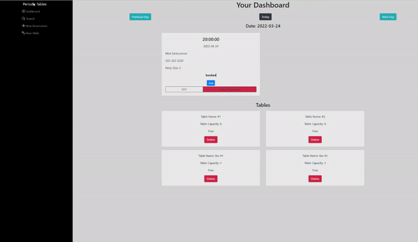

# Restaurant Reservation

This app allows restaurants to track their reservations and tables as well as assigning and updating their progress.

## Motivation

This was created as part of my project for the Thinkful Software Engineering course. The project imitates the POS system in managing reservations and tables.

## Live App

The full application: [Restaurant Reservation-Front-End](https://capstone-project-restaurant-reservation-frontend.vercel.app/)

The backend API is currently running here: [Restaurant Reservation-Back-End](https://capstone-project-restaurant-reservation-backend.vercel.app/)

API paths for back-end, use the endpoints: `/reservations` or `/tables`

## Screenshots

## Technology

Built with

- Javascript
- HTML
- CSS
- ElephantSQL
- Knex
- Node
- React & React Hooks
- Deployed on Vercel
-

## Features

- Dashboard section (home)
- Search by phone number of reservation
- Create a new reservation
- Create a new table, assigning name and capacity

## Installation

1. Fork and clone this repository
2. Run cp `./back-end/.env.sample ./back-end/.env`
3. Update the `./back-end.env` file with the connection URL's to your SQL database instance
4. Run cp `./front-end/.env.sample ./front-end/.env`
5. You should not need to make changes to the `./front-end/.env` file unless you want to connect to a backend at a location other than `http://localhost:5000`
6. Run `npm install` to install project dependencies
7. Run `npm run start:dev` to start your server in development mode

If you have trouble getting the server to run, feel free to reach out to me!

## Contributing

Pull requests are welcome. For major changes, please open an issue first to discuss what you would like to change.

Please make sure to update tests as appropriate.

## Credits

Starter code by @ [Thinkful](https://github.com/Thinkful-Ed)

## Author

[Anon Vanichyanukroh](https://github.com/avthedev)
